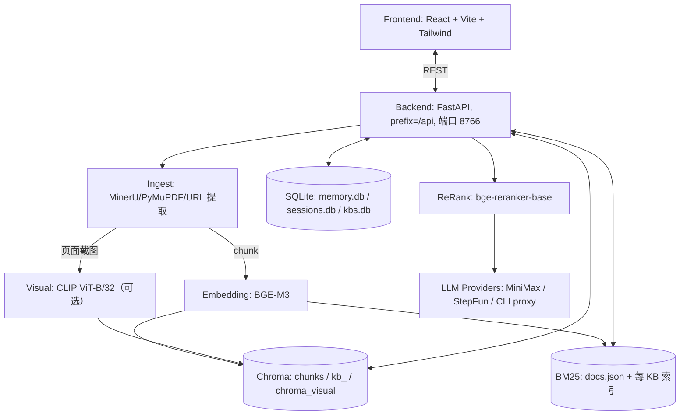

# Architecture

> 更新于 2026-08（v0.3+ 多知识库 + memory/session 阶段）。行号与端口以代码为准。

## 1. 系统概览

uni-rag 是面向中文研究者的私有文档工作站：后端 FastAPI（解析 / 检索 / 引用 / 记忆），前端 React SPA，全部数据落本地 `<data_dir>`（默认 `./data`，Docker 内为 `/data`）。

## 2. 数据布局（`<data_dir>`，默认 `./data`，Docker 为 `/data`）

| 路径 | 内容 |
| --- | --- |
| `data/uploads/` | 上传文件的权威原文（legacy 单库）；每 KB 存 `data/kbs/<id>/uploads/` |
| `data/chroma/` | legacy 默认库的 chunk 向量（collection `chunks`） |
| `data/kbs/<id>/chroma/` | 每 KB 向量库，collection `kb_<id>` |
| `data/kbs/<id>/chroma_visual/` | 每 KB 视觉通道 collection `kb_<id>_visual`（另有 legacy `chroma_visual`） |
| `data/bm25/docs.json`、`data/kbs/<id>/bm25/` | 默认库与每 KB 的 BM25 关键词索引 |
| `data/memory.db` | saved_memories（用户保存的笔记/卡片，LIKE 检索） |
| `data/sessions.db` | 会话 messages（上限 `UNI_RAG_MAX_SESSION_MESSAGES`，默认 20） |
| `data/kbs.db` | `knowledge_bases` + `session_kbs`（KB 元数据与会话绑定） |
| `data/visual_tiles/<source_id>/` | PDF 页面截图 tile（视觉 RAG 用） |
| `data/parsed/<source_id>.md` | 解析全文 sidecar（ingest 时写入，citation span 定位优先读取；可用 `UNI_RAG_PARSED_DIR_PATH` 覆盖） |

`source_id` = `sha256(路径 + 前 1MB)[:16]`（文件）或 `sha256(url + 正文前 1MB)[:16]`（URL）。

## 3. Ingest（`src/uni_rag/ingest/`）

- **PDF**：MinerU 云端解析优先（`mineru_client`，需 `UNI_RAG_MINERU_API_TOKEN`），失败回退 PyMuPDF（本地逐页提取文本 + 可选页面截图）。MinerU 路径产出整篇 Markdown（页码丢失，`pages=None`）。
- **文档**：docx、md/markdown；HTML 网页内容经 URL 链路提取为纯文本。
- **URL**：`link_extractors` 按 YouTube → Bilibili → Trafilatura 分派；YouTube 内部降级：字幕 → yt-dlp 音轨 → faster-whisper 转写。
- **分块**：按标题层级分块，超长段落按 1000 字符切分（`chunker.max_chars`），保留 section 标题与页码。
- **嵌入**：BGE-M3（1024 维，本地）；CLIP ViT-B/32 视觉通道可选（`visual_embedder`，对页面截图嵌入）。
- **质量过滤**：启发式 `ChunkQualityFilter`（丢弃噪声/过短块）。
- 入库完成后把解析全文写入 sidecar `data/parsed/<source_id>.md`（`_save_parsed_sidecar`）。

## 4. Retrieve（`src/uni_rag/retrieve/`）

混合检索：向量 top_k×3 + BM25 top_k×3 → 按 chunk_id 合并去重 → `bge-reranker-base` CrossEncoder 重排取 top_k。按 `kb_id` 隔离：legacy 模式走默认 collection 与 `data/bm25/`，KB 模式走 `data/kbs/<id>/`。

## 5. Cite（`src/uni_rag/cite/`）

- 从回答中正则抽取 `[chunk_id:n]`（`_CITE_RE`）。
- `locator.locate_citation` 在全文中定位 span：**优先读 `data/parsed/<source_id>.md` sidecar**（PDF 原文是二进制，直接 read_text 得到乱码定位不到），sidecar 缺失时回退读 `uploads/` 原文。
- `verifier` 用 BGE-M3 余弦相似度校验「声明 vs 被引 chunk」，阈值 `UNI_RAG_CITE_SIMILARITY_THRESHOLD`（默认 0.45）。
- memory citations（`source_type="saved_memory"`）不走校验，查询返回时无条件追加，携带 `contract_version="reader-unirag-memory-v1"`。

## 6. API（`src/uni_rag/api/`）

FastAPI，路由 `prefix="/api"`。端点族：

- `health`、`providers`
- `ingest/jobs`（异步 job：提交 + 轮询状态）、`ingest`（同步）、`ingest/url`（含 SSRF 检查）
- `memory/jobs`（Reader fast-path：同步返回 completed）
- `query`、`suggest-questions`
- `documents` / `files` / `sources`（文档列表与 chunks 查看）
- `kbs` 管理（创建/列表/删除/入库/查询）、`sessions/{id}/kbs`（会话绑定 KB）
- `sessions/{id}/messages/{index}/export`（md/pdf 导出）

CORS 仅允许 `localhost` / `127.0.0.1`（正则 `^http://(127\.0\.0\.1|localhost):\d+$`）。静态前端挂 `/static`，`/` 返回 `web/index.html`。

## 7. LLM（`src/uni_rag/llm/`）

Anthropic SDK 包装（`client.py`），provider 注册表在启动时由 env 动态初始化（默认 MiniMax；StepFun、CLI proxy 等 OpenAI/Anthropic 兼容端点）。Reader 侧可透传 `provider` + `api_key`（`with_provider` / `with_api_key`）。

## 8. 端口与运行

- 默认端口 **8766**（README、`scripts/dev-unirag.sh`、Docker `EXPOSE 8766`；uvicorn host/port 由启动命令显式指定，不走 Settings）。
- 数据目录 env 为 `UNI_RAG_DATA_DIR_PATH`（字段 `data_dir_path`；误设 `UNI_RAG_DATA_DIR` 会被 `extra="ignore"` 静默忽略）。启动日志会打印最终解析的 `data_dir`。

## 9. 后续演进点 (Tech Debt)

- 缺乏基于 Playwright 的前端自动化 UI 测试。
- 缺乏对 `/api/sources` 针对大型 Chroma 库的翻页/性能优化。
- ingest/memory job 状态保存在进程内存，服务重启即失。
- Chroma 与 BM25 双写无事务，极端情况下两侧索引可能不一致。
